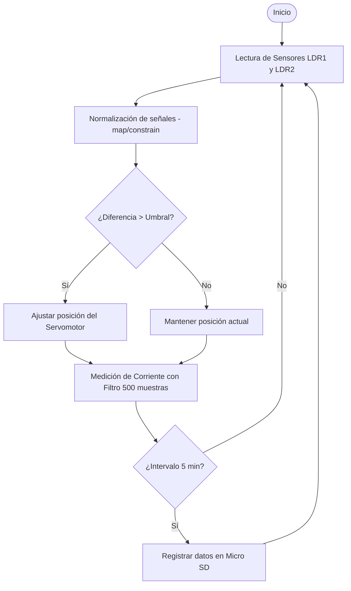

# Estación Didáctica de Bajo Costo para Seguimiento Solar y Adquisición de Datos Meteorológicos

## 📌 Descripción
Este proyecto presenta el desarrollo de un prototipo de seguidor solar monaxial de bajo costo. El sistema no solo optimiza la captación fotovoltaica mediante un control de lazo cerrado, sino que funciona como una estación de adquisición de datos (Datalogger) para variables críticas como temperatura, humedad, irradiancia y corriente generada.

## 🎯 Objetivos
- Implementar un sistema de seguimiento solar en un eje con control de lazo cerrado.
- Integrar sensores de irradiancia (LDR), temperatura/humedad (DHT11) y corriente (ACS712).
- Diseñar un sistema de adquisición de datos no bloqueante y replicable.
- Validar experimentalmente el incremento de eficiencia frente a sistemas estáticos en Suchiapa, Chiapas.

## ⚙️ Lógica del Algoritmo
El sistema utiliza un algoritmo de control que procesa señales analógicas, aplica un filtro de sobremuestreo estadístico para la corriente y gestiona el almacenamiento en SD cada 5 minutos.

