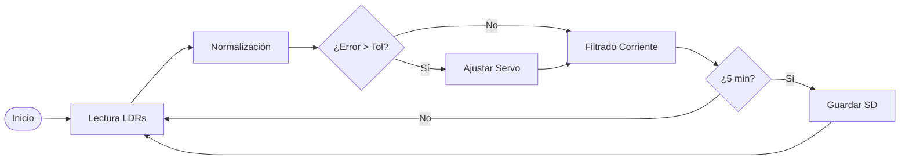

# Estación Didáctica de Bajo Costo para Seguimiento Solar y Adquisición de Datos Meteorológicos

## 📌 Descripción
Este proyecto presenta el desarrollo de un prototipo de seguidor solar monaxial de bajo costo. El sistema no solo optimiza la captación fotovoltaica mediante un control de lazo cerrado, sino que funciona como una estación de adquisición de datos (Datalogger) para variables críticas como temperatura, humedad, irradiancia y corriente generada.

## 🎯 Objetivos
- Implementar un sistema de seguimiento solar en un eje con control de lazo cerrado.
- Integrar sensores de irradiancia (LDR), temperatura/humedad (DHT11) y corriente (ACS712).
- Diseñar un sistema de adquisición de datos no bloqueante y replicable.
- Validar experimentalmente el incremento de eficiencia frente a sistemas estáticos en Suchiapa, Chiapas.

## ⚙️ Lógica del Algoritmo
El sistema utiliza un algoritmo de control que procesa señales analógicas, aplica un filtro de sobremuestreo estadístico para la corriente y gestiona el almacenamiento en SD cada 5 minutos.

## 📊 Resultados Experimentales
A continuación, se presenta una comparativa del rendimiento obtenida durante las jornadas de prueba en campo:

### Tabla 1. Muestra de Datos del Modelo Dinámico (Intervalo de 1 Hora)

| Temperatura (°C) | Humedad (%) | LDR_Izq | LDR_Der | Ángulo (°) | Corriente (A) |
| :--- | :--- | :--- | :--- | :--- | :--- |
| 32.4 | 45.2 | 845 | 842 | 95 | 0.42 |
| 33.1 | 44.1 | 870 | 868 | 102 | 0.48 |
| 34.0 | 42.8 | 910 | 908 | 110 | 0.54 |
| 35.1 | 40.5 | 968 | 965 | 125 | 0.63 |
| 36.0 | 38.5 | 990 | 988 | 135 | 0.68 |

### Tabla 2. Comparativa de Eficiencia: Modelo Estático vs. Dinámico

| Hora del día | Ángulo Dinámico | Corriente Dinámica | Corriente Estática | Ganancia (%) |
| :--- | :---: | :---: | :---: | :---: |
| 09:00 | 45° | 0.38 A | 0.22 A | **+72.7%** |
| 11:00 | 75° | 0.52 A | 0.41 A | **+26.8%** |
| 13:00 | 90° | 0.68 A | 0.65 A | **+4.6%** |
| 15:00 | 115° | 0.58 A | 0.38 A | **+52.6%** |
| 17:00 | 145° | 0.41 A | 0.18 A | **+127.7%** |

## 🛠️ Tecnologías utilizadas
- **Microcontrolador:** Arduino Uno R4 WiFi.
- **Sensores:** LDR (Fotoresistencias), DHT11 (Clima), ACS712 (Corriente).
- **Actuadores:** Servomotor SG90.
- **Almacenamiento:** Módulo Micro SD (SPI).
- **Software:** C++ (Arduino IDE), MATLAB (Análisis de datos).

## 📂 Estructura del repositorio
- `docs/`: Artículos científicos y documentación técnica.
- `hardware/`: Diagramas eléctricos y lista de materiales.
- `src/`: Código fuente (.ino) comentado línea por línea.
- `data/`: Archivos `DATOS.CSV` recolectados en Suchiapa.
- `images/`: Fotografías del prototipo y gráficas de rendimiento.

## 👥 Autores
- **César Emmanuel Llaven Ovilla** – Universidad Politécnica de Chiapas.
- **Samuel Coello García** – Universidad Politécnica de Chiapas.
- **Alejandro Medina Santiago** – INAOE.
- **Christian Roberto Ibáñez Nangüelú** – Universidad Politécnica de Chiapas.

## 📜 Cita y Licencia
Si utilizas este código o los datos para fines académicos, por favor cita de la siguiente manera:
> Ibáñez Nangüelú, C. R. (2026). *Solar Tracker Didáctico: Estación de seguimiento solar y adquisición de datos meteorológicos de bajo costo* [Repositorio de software]. GitHub. https://github.com/cribnez/solar-tracker-didactico/tree/main

Este proyecto se distribuye bajo la licencia **MIT**.
